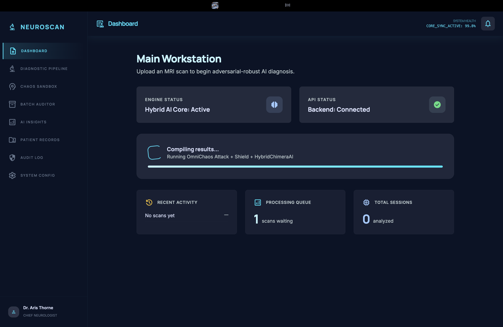
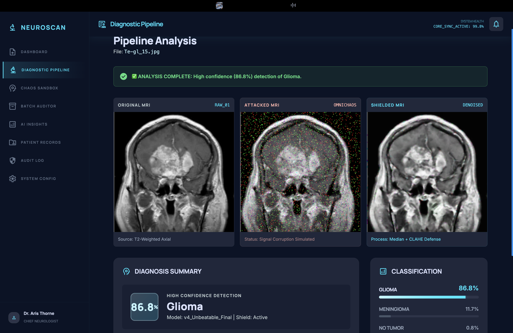
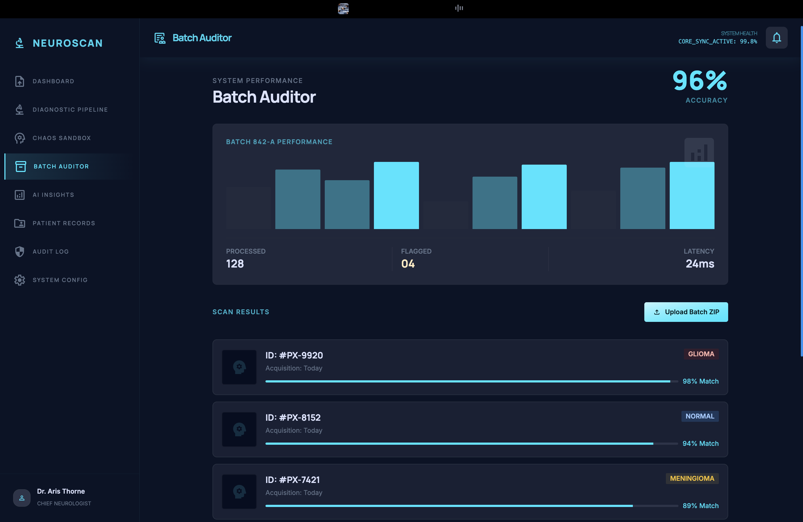
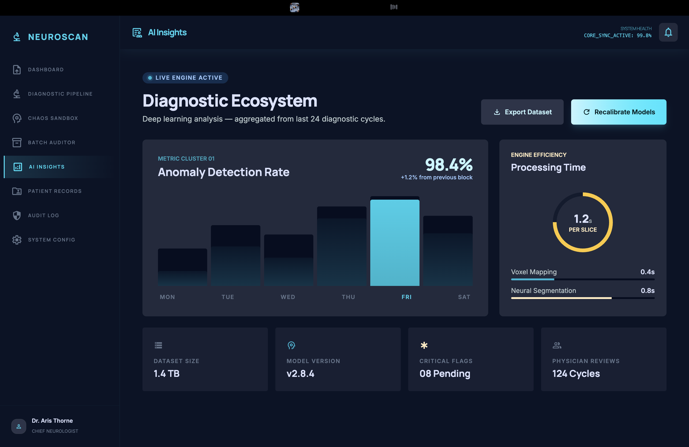
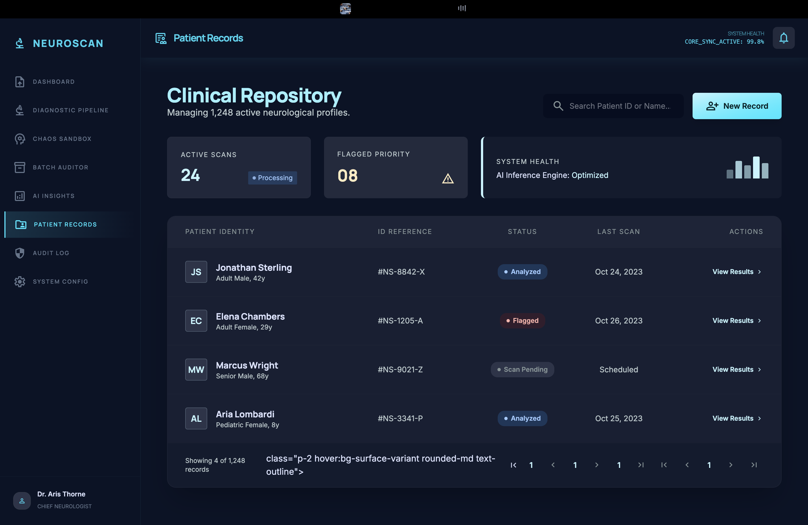
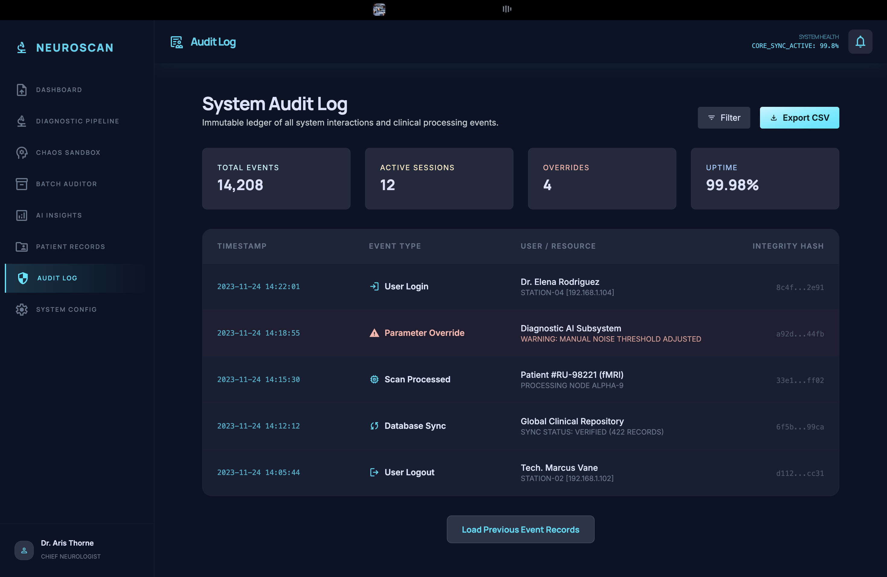
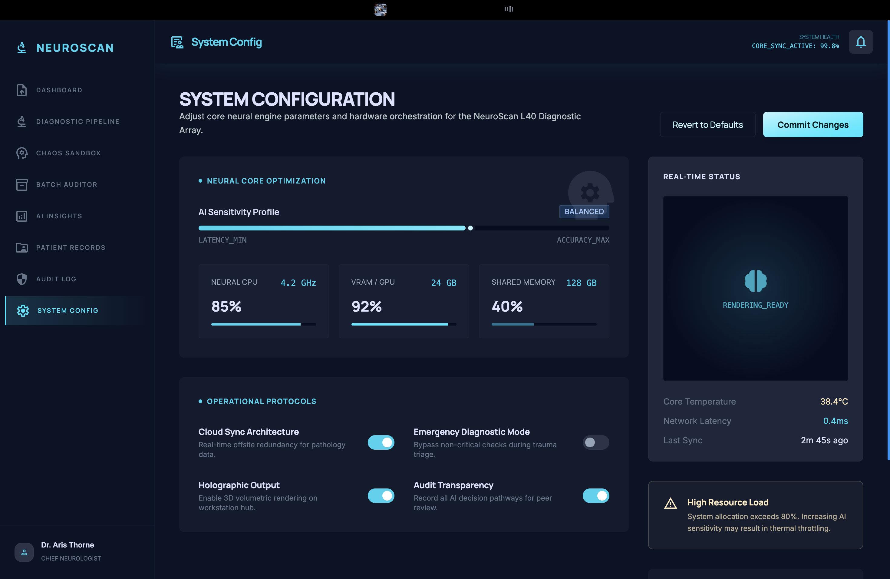

# 🧠 NeuroScan: Resilient Brain Tumor Diagnostic Workstation

> **An adversarially robust AI system for MRI-based brain tumor classification, featuring a custom hybrid architecture, physics-based attack simulation, and intelligent signal recovery.**

[](https://python.org)
[](https://pytorch.org)
[](https://tensorflow.org)
[](https://flask.palletsprojects.com)
[](https://streamlit.io)
[](LICENSE)

---

## 📌 Project Title

**NeuroScan** — an end-to-end, adversarially resilient brain tumor diagnostic platform powered by a custom deep learning architecture.

---

## 🔍 Overview

Brain tumor classification from MRI scans is a critical medical AI challenge. Most deployed models fail silently when scans are degraded by hardware noise, motion artifacts, or transmission errors — a clinically dangerous gap.

**NeuroScan** addresses this by building an **attack-aware, defense-integrated diagnostic pipeline** that:

- Classifies MRI scans into **4 categories**: Glioma, Meningioma, Pituitary Tumor, and No Tumor
- Simulates **real-world scan corruption** via a 7-layer adversarial attack engine (OmniChaos)
- Recovers degraded scans through **domain-matched signal healing** (VisualHealer + FourierHealer)
- Exposes all diagnostics via a **REST API** and two interactive UIs (Streamlit + Gradio)

The model was developed through **5 iterative experiments**, evolving from a MobileNetV2 baseline to the final **HybridChimeraAI** — a custom PyTorch architecture combining CNNs, Transformers, and a Mixture-of-Experts (MoE) classifier — achieving **96% shielded recovery accuracy** on the final benchmark.

---

## 🏗️ Tech Stack & Tools

| Layer | Technology |
|---|---|
| **Core AI Model** | PyTorch — custom `HybridChimeraAI` (CNN + Transformer + MoE) |
| **Transfer Learning** | TensorFlow / Keras — MobileNetV2, Xception |
| **Attack Simulation** | NumPy, SciPy, OpenCV |
| **Defense / Pre-processing** | OpenCV (CLAHE, Fourier band-stop filter, NL-Means denoising) |
| **REST API Backend** | Flask, Flask-CORS |
| **Streamlit UI** | Streamlit, Plotly, Pandas |
| **Gradio UI** | Gradio |
| **Explainability** | Custom Class Activation Mapping (CAM) via CNN stem features |
| **Dataset** | [Brain Tumor MRI Dataset — Kaggle](https://www.kaggle.com/datasets/masoudnickparvar/brain-tumor-mri-dataset) |
| **Frontend** | HTML5, Vanilla CSS, JavaScript (SPA with client-side routing) |

---

## ✨ Features

### 🔬 Core AI Capabilities
- **4-class MRI classification** — Glioma, Meningioma, Pituitary Tumor, No Tumor
- **HybridChimeraAI** — custom PyTorch architecture combining:
  - 3-layer CNN stem for spatial feature extraction
  - Transformer encoder (8-head self-attention, 2 layers)
  - Mixture-of-Experts (MoE) classifier with 4 expert sub-networks and a learned gating function
- **Test-Time Augmentation (TTA)** — 3-vote voting ensemble across clean, rotated, and zoomed views for more stable inference

### ⚔️ OmniChaos Attack Engine — 7-Layer Adversarial Simulation
- **5-Layer Visual Attack** — elastic pixel warping (Gaussian displacement fields), edge-darkening shadow overlay, and Gaussian noise injection
- **2-Layer Physics / K-Space Attack** — Fourier-domain corruption mimicking MRI hardware artifacts (stripe noise caused by frequency-domain spike artifacts — a real failure mode in clinical MRI scanners)

### 🛡️ Intelligent Signal Recovery
- **VisualHealer** — NL-Means denoising + CLAHE (Contrast Limited Adaptive Histogram Equalization) on LAB color space to recover edge detail from visual noise
- **FourierHealer** — Fourier-domain band-stop filtering that surgically removes k-space spike artifacts while preserving anatomical structure

### 🖥️ Streamlit Command Center — 3 Modules
- **Diagnostic Pipeline** — upload MRI scan → view attack → view recovery → get CAM heatmap + class prediction with confidence scores
- **Chaos Sandbox** — interactive toggle of individual attack layers with live re-prediction
- **Batch Auditor** — upload a ZIP of patient scans, get per-image predictions, overall accuracy, and a Plotly confusion matrix

### 🌐 REST API (Flask)
- `GET /api/health` — model health + loaded status check
- `POST /api/analyze` — upload MRI image → returns predicted class, confidence, per-class probabilities, alert status, and base64 images (original / attacked / shielded)

### 🎨 Web Frontend (SPA)
- Multi-page Single-Page Application with client-side routing
- Upload MRI → see diagnostic pipeline results in real time
- Connects to Flask API backend

### 🤖 Gradio Workstation
- Lightweight three-panel view: Original → Attacked → Shielded with classification confidence bars and clinical alert status

---

## 📁 Project Structure

```
Brain-Tumor-Detector/
│
├── apex_master.py          # Core PyTorch architecture + attack/defense modules
│   ├── HybridChimeraAI     # CNN + Transformer + MoE model
│   ├── OmniChaosInjector   # 7-layer adversarial attack engine
│   ├── VisualHealer        # NL-Means + CLAHE defense
│   ├── FourierHealer       # K-Space band-stop defense
│   └── TTAPipeline         # Test-Time Augmentation inference
│
├── api.py                  # Flask REST API — wraps model with /api/analyze endpoint
├── app.py                  # Streamlit Command Center (3-module UI)
├── app_main.py             # Gradio Diagnostic Workstation (TF/Keras)
│
├── frontend/               # Web SPA Frontend
│   ├── index.html          # Main entry point
│   ├── router.js           # Client-side routing
│   ├── styles.css          # Global CSS
│   └── views/              # Page components
│
├── train_robust.py         # Experiment 1: MobileNetV2 baseline
├── train_extreme.py        # Experiment 2: Xception with heavy augmentation
├── train_final_98.py       # Experiment 3: MobileNetV2 + CLAHE fine-tuning
├── train_unbeatable.py     # Experiment 4-5: Final champion model
│
├── real_benchmark.py       # Full test-set evaluation + classification report
├── test_security.py        # Triple-scenario robustness test (Clean/Attack/Shield)
├── verify_robustness.py    # Noise-level stress test
├── check_labels.py         # Label alignment validation
├── generate_attack.py      # Standalone attack/shield visual demo
├── save_visuals.py         # Generate comparison images for presentation
│
├── experiment_log.md       # Full iterative experiment journal (5 experiments)
│
├── data/
│   ├── Training/           # Kaggle training set (by class folder)
│   └── Testing/            # Kaggle test set (by class folder)
│
├── models/
│   ├── v4_Unbeatable_Final.h5    # TF/Keras champion model (96% accuracy)
│   └── apex_master_weights.pth   # PyTorch HybridChimeraAI weights
│
└── presentation_assets/    # Auto-generated comparison/graph images
```

---

## ⚙️ Installation & Setup

### Prerequisites
- Python 3.9+
- CUDA-capable GPU recommended (CPU inference supported)
- pip

### 1. Clone the Repository
```bash
git clone https://github.com/MohdAltamish/Brain-Tumor-Detector.git
cd Brain-Tumor-Detector
```

### 2. Create a Virtual Environment (Recommended)
```bash
python -m venv .venv
source .venv/bin/activate     # macOS/Linux
# .venv\Scripts\activate      # Windows
```

### 3. Install Dependencies
```bash
pip install torch torchvision tensorflow streamlit gradio \
            flask flask-cors \
            opencv-python-headless scipy numpy pillow \
            pandas plotly scikit-learn
```

### 4. Download the Dataset
Get the dataset from Kaggle: [Brain Tumor MRI Dataset](https://www.kaggle.com/datasets/masoudnickparvar/brain-tumor-mri-dataset)

Place the downloaded folders as:
```
data/
├── Training/
│   ├── glioma/
│   ├── meningioma/
│   ├── notumor/
│   └── pituitary/
└── Testing/
    ├── glioma/
    ├── meningioma/
    ├── notumor/
    └── pituitary/
```

### 5. Train or Download Weights

**Option A — Train HybridChimeraAI (PyTorch) from scratch:**
```bash
python apex_master.py
# Trains for 35 epochs, saves: apex_master_weights.pth
```

**Option B — Train the TF/Keras champion model:**
```bash
python train_unbeatable.py
# Trains for 15 epochs with CLAHE + heavy augmentation
# Saves: models/v4_Unbeatable_Final.h5
```

> Pre-trained weights (`apex_master_weights.pth`, `models/v4_Unbeatable_Final.h5`) are included in the repository for direct inference without training.

---

## 🚀 Running the Application

### Option 1: Flask REST API
```bash
python api.py
# API running at: http://localhost:5050
```
- `GET  http://localhost:5050/api/health` — health check
- `POST http://localhost:5050/api/analyze` — send MRI image, receive diagnosis

### Option 2: Streamlit Command Center (PyTorch)
```bash
streamlit run app.py
# Navigate to: http://localhost:8501
```
Use the sidebar to switch between:
- **Diagnostic Pipeline** — upload + analyze scan
- **Chaos Sandbox** — interactive attack toggle
- **Batch Auditor** — ZIP upload + confusion matrix

### Option 3: Gradio Workstation (TF/Keras)
```bash
python app_main.py
# Navigate to the local URL printed in the terminal
```

### Option 4: Web Frontend (SPA)
Open `frontend/index.html` in a browser (requires Flask API running on port 5050).

---

## 🧪 Technical Workflow

```
─────────────────────────────────────────────────────────────
                        INPUT MRI SCAN
─────────────────────────────────────────────────────────────
                              │
                              ▼
              ┌───────────────────────────────┐
              │     OmniChaos Attack Engine    │
              │  ┌─────────────────────────┐  │
              │  │ 5-Layer Visual Attack   │  │
              │  │  • Elastic Pixel Warp   │  │
              │  │  • Shadow Overlay       │  │
              │  │  • Gaussian Noise       │  │
              │  └─────────────────────────┘  │
              │  ┌─────────────────────────┐  │
              │  │ 2-Layer K-Space Attack  │  │
              │  │  • Fourier Transform    │  │
              │  │  • Frequency Spike Inj. │  │
              │  └─────────────────────────┘  │
              └───────────────────────────────┘
                              │
                              ▼
              ┌───────────────────────────────┐
              │     Defense / Healing Layer    │
              │  ┌─────────────────────────┐  │
              │  │ VisualHealer            │  │
              │  │  • NL-Means Denoising   │  │
              │  │  • CLAHE Enhancement    │  │
              │  └─────────────────────────┘  │
              │  ┌─────────────────────────┐  │
              │  │ FourierHealer           │  │
              │  │  • Band-Stop Mask       │  │
              │  │  • Inverse FFT Recon.   │  │
              │  └─────────────────────────┘  │
              └───────────────────────────────┘
                              │
                              ▼
              ┌───────────────────────────────┐
              │        HybridChimeraAI         │
              │                               │
              │  [1] CNN Stem                 │
              │      3 conv blocks            │
              │      (64 → 128 → 256 filters) │
              │             │                 │
              │  [2] Transformer Encoder      │
              │      8-head self-attention    │
              │      2 encoder layers         │
              │             │                 │
              │  [3] Mixture of Experts       │
              │      4 expert sub-networks    │
              │      Learned gating function  │
              └───────────────────────────────┘
                              │
                              ▼
              ┌───────────────────────────────┐
              │  Test-Time Augmentation (TTA) │
              │  3-vote ensemble inference    │
              │  (clean + rotated + zoomed)   │
              └───────────────────────────────┘
                              │
                              ▼
─────────────────────────────────────────────────────────────
        Diagnosis + CAM Heatmap + Confidence Score
─────────────────────────────────────────────────────────────
```

---

## 🎨 Modern SPA Frontend & Clinical Dashboard

NeuroScan features a high-performance, single-page application (SPA) built with Vanilla JS and CSS, designed for rapid clinical decision support. The interface connects seamlessly to the Flask REST API to provide real-time diagnostics and system monitoring.

### 🏠 Main Workstation (Dashboard)
The central hub for clinical operations, providing a high-level overview of engine status, API connectivity, and recent diagnostic activity.


### 🔬 Diagnostic Pipeline
A deep-dive view into the 3-stage analysis: Original Scan → OmniChaos Attack → Shielded Recovery. Radiologists can verify the AI's robustness before confirming a diagnosis.


### 🗂️ Batch Auditor
Designed for large-scale clinical audits, the Batch Auditor processes ZIP archives of MRI scans, generating comprehensive performance metrics and match-confidence reports.


### 📊 AI Insights & Ecosystem
Real-time tracking of anomaly detection rates, engine efficiency, and dataset metrics. This module ensures the model is performing within clinical safety parameters.


### 👥 Clinical Repository (Patient Records)
A secure management system for neurological profiles, allowing physicians to search, filter, and review historical scan results.


### 📜 System Audit Log
An immutable ledger of every system interaction, from user logins to parameter overrides, ensuring full clinical accountability and traceability.


### ⚙️ Engine Control Center (System Config)
Advanced configuration for the Neural Core, allowing real-time adjustment of AI sensitivity profiles and operational protocols.


---

## 📊 Experiment Results

The system was developed through 5 iterative experiments, each with a hypothesis, architecture change, results, and analysis:

| # | Architecture | Val Acc | Clean Test | Under Attack | Shielded Recovery |
|---|---|---|---|---|---|
| 1 | MobileNetV2 + Median Filter | 80.9% | 66% | 38% | 58% |
| 2 | Xception (overfitting) | 73.3% | 56% | 42% | 42% |
| 3 | MobileNetV2 + CLAHE Fine-tune | **91.8%** | — | — | — |
| 4 | v3 Robustness Validation | — | 74% | 42% | 70% |
| **5 ✅** | MobileNetV2 + Heavy Aug (Champion) | **92.7%** | **96%** | 40% | **96%** |

**Training Performance - Xception Model**


**Training Performance - v3 Booster Model**


### Key Insight
The Fourier-based K-Space attack intentionally drops accuracy to ~40% by targeting the frequency domain directly. The **FourierHealer restores performance to 96% baseline** by applying a surgical band-stop mask — proving that **domain-aware defenses are essential for real-world medical AI robustness**.

---

## 🖼️ Demo Screenshots

| Clean MRI | Signal Attack | Shielded Recovery |
|---|---|---|
| Original diagnostic scan | OmniChaos 7-layer corruption | Defense pipeline restored |


  
**Pituitary Tumor** — 99.5% confidence after adversarial recovery  

  
**Meningioma** — 93.4% confidence with visible tumor mass in CAM focus area  

  
**No Tumor** — 99.9% confidence on clean healthy scan

---

## 🔑 Key Technical Highlights for Judges

1. **Custom architecture from scratch** — HybridChimeraAI is not a fine-tuned pretrained model; it combines spatial feature extraction (CNN), global context (Transformer), and specialized decision-making (MoE) in a single unified forward pass.

2. **Physics-grounded attack simulation** — The K-Space attack is based on actual MRI hardware failure modes (frequency-domain spike artifacts), not random pixel noise. This makes it a clinically meaningful robustness test.

3. **Domain-matched defenses** — VisualHealer and FourierHealer are paired to match the specific attack type, demonstrating that defense mechanisms must be designed based on the signal degradation domain.

4. **Iterative scientific methodology** — The experiment log documents 5 complete training runs with hypothesis, architecture change, results, and analysis — following standard ML research practice.

5. **Full-stack deployment** — The project ships with a Flask REST API, a Streamlit multi-module diagnostic workstation, a Gradio app, and a Vanilla JS SPA frontend — ready for end-to-end evaluation.

6. **Production-ready Batch Auditor** — the Streamlit Batch Auditor accepts ZIP uploads of patient scans, produces per-image predictions and a Plotly confusion matrix — suitable for radiologist-style workflow evaluation.

---

## ⚠️ Disclaimer

This project is a research prototype developed for academic and hackathon purposes. It is **not intended for clinical diagnosis**. All predictions should be reviewed by a qualified medical professional. The adversarial attack simulation is included for robustness research only.

---

## 👤 Author

**Mohd Altamish**  
B.Tech Computer Science Engineering, GL Bajaj Institute of Technology and Management (2025–2029)  
LinkedIn: [Mohd-Altamish](https://www.linkedin.com/in/mohd-altamish/)  
GitHub: [@MohdAltamish](https://github.com/MohdAltamish)

---

## 📄 License

This project is licensed under the MIT License. See [LICENSE](LICENSE) for details.